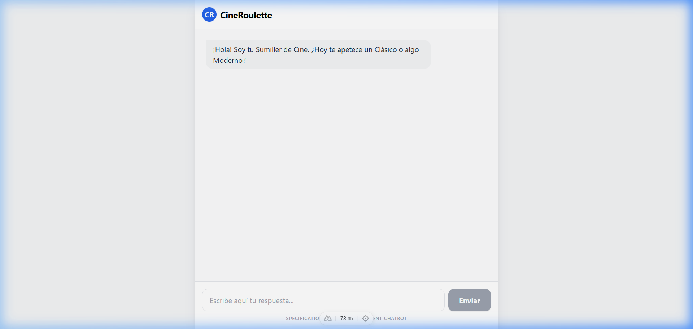
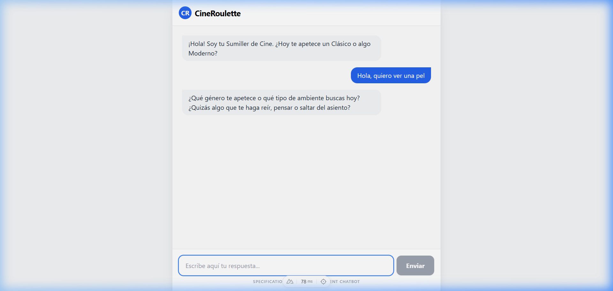
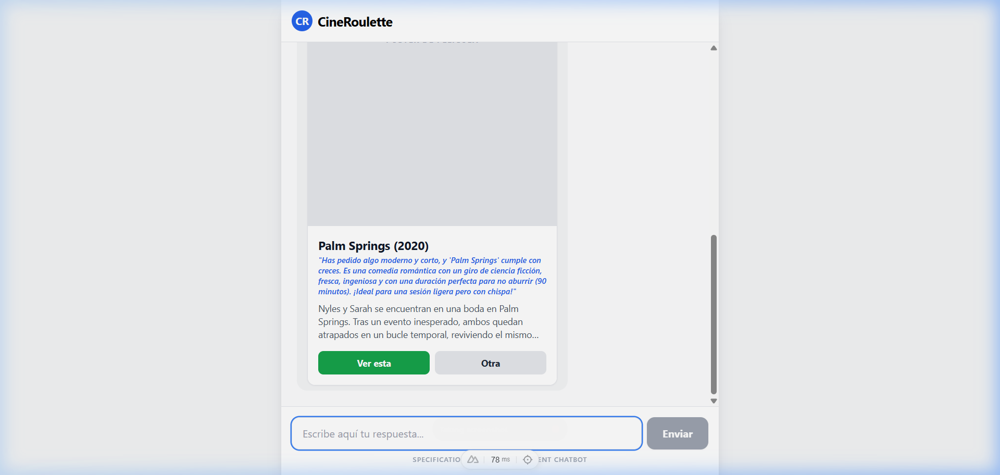

# Documentació de l'Aplicació: CineRoulette

**Projecte:** CineRoulette - AI-Driven Movie PWA  
**Autoria:** Moisés Garcia  
**Assignatura:** M06 - Desenvolupament Web en Entorn Client  
**Data:** 19 de Març de 2026

---

## 1. Explicació de les funcionalitats de l’aplicació

### Descripció general

CineRoulette és una aplicació web progressiva (PWA) que actua com un "sumiller de cinema" personal. L'objectiu principal és resoldre el problema de la "paràlisi per anàlisi" que pateixen els usuaris davant els vasts catàlegs de les plataformes de streaming actuals.

### Principals característiques

- **Entrevista Dinàmica**: L'usuari no navega per una llista, sinó que respon a 2-3 preguntes clau fetes per una IA (Google Gemini). Aquestes preguntes estan dissenyades per filtrar l'estat d'ànim i les preferències del moment.
- **Recomanacions Personalitzades**: Utilitzant el model Gemini 2.5 Flash, el sistema genera una recomanació única basada en les respostes de l'usuari.
- **Rationale (Raonament)**: Cada pel·lícula ve acompanyada d'una explicació de per què li agradarà a l'usuari segons el que ha dit durant el xat.
- **Persistència amb Supabase**: Les pel·lícules que l'usuari decideix "acceptar" es guarden en un historial personalitzat a la base de dades.
- **Progressive Web App (PWA)**: L'aplicació es pot instal·lar en el telèfon mòbil, funciona sense barra de navegació del navegador i ofereix una experiència fluida.

### Casos d'ús

1. **Descobriment ràpid**: Un usuari arriba a casa cansat i no vol buscar durant 20 minuts. Obre CineRoulette, respon que vol "acció" i "algo curt", i rep una recomanació instantània.
2. **Historial de visualització**: L'usuari guarda la pel·lícula recomanada per veure-la més tard, assegurant-se que no perd la selecció feta per la IA.

---

## 2. Captures de l’aplicació

_(Aquestes captures mostren el flux des de l'inici del xat fins a la recepció de la fitxa de la pel·lícula)_


_Pantalla d'inici on el sumiller inicia la conversa._


_Exemple d'usuari responent a les preguntes de la IA._


_Fitxa de pel·lícula generada amb el motiu de la recomanació i botons d'acció._

---

## 3. Procés d’especificació (Spec-Driven Development)

Per al desenvolupament d'aquest projecte s'ha utilitzat una metodologia **Spec-Driven Development (SDD)** mitjançant l'ús de l'agent **Speckit**. Aquest procés assegura que cada línia de codi respon a un requeriment prèviament definit.

### a. Foundations (Fonaments)

En aquesta fase es va definir el nucli del projecte:

- **Objectiu**: Crear un recomanador de cinema que no s'assembli a un e-commerce tradicional.
- **Abast**: MVP que inclou xat amb IA, renderitzat de targetes i persistència de dades.
- **Context**: Projecte Nuxt 3 amb integració directa de APIs d'IA i DB as a Service (Supabase).

### b. Specify (Especificar)

Utilitzant el comandament `/speckit.specify`, es van definir els requeriments funcionals (FR) i els criteris d'èxit (SC):

- **FR-001**: Implementació com a PWA.
- **FR-004**: Ús de Supabase per a `movies` i `user_history`.
- **SC-001**: Temps de resposta de la IA inferior a 3 segons.

### c. Planning (Planificació)

L'organització de tasques es va realitzar en tres fases principals (reflectides en el fitxer `tasks.md`):

1. **Fase 0**: Setup del projecte i configuració de dependències.
2. **Fase 1**: Desenvolupament del backend (Nitro + Gemini).
3. **Fase 2**: Frontend i interfície de xat amb Tailwind.

---

## 4. Annex amb fitxers rellevants

### Fitxer: tasks.md

```markdown
# Tasks: CineRoulette Implementation

## Phase 1: Database & AI Backend

- [x] Implement Gemini AI utility in `server/utils/ai.ts`
- [x] Create API Endpoint `/server/api/chat.post.ts`

## Phase 2: Frontend & Chat Interface

- [x] Build `ChatMessage` component
- [x] Build `MovieCard` component
- [x] Implement Chat page layout
```

### Fitxer: SPEC.md (Fragment)

> **User Story 1 - AI-Guided Movie Discovery**
> As a visitor, I want to interact with a chatbot that asks me 2-3 targeted questions, so that I can receive a personalized movie recommendation without browsing a catalog.

---

© 2026 CineRoulette Project. All rights reserved.
